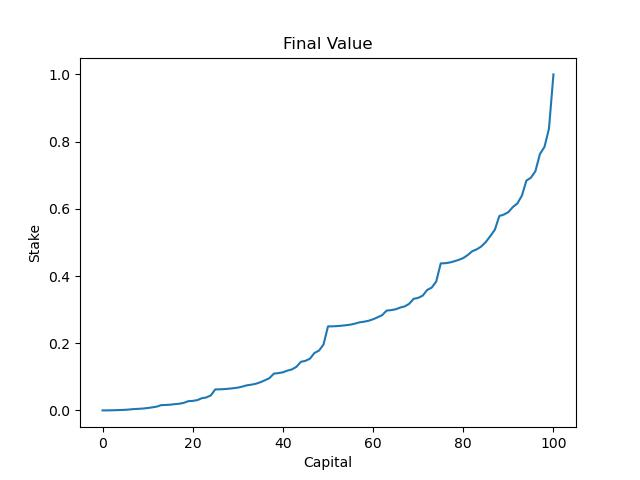

### Exercise 4.7

Implement value iteration for the gambler’s problem and
solve it for ph = 0.25 and ph = 0.55. In programming, you may find it convenient to
introduce two dummy states corresponding to termination with capital of 0 and 100,
giving them values of 0 and 1 respectively. Show your results graphically, as in Figure 4.3.
Are your results stable as theta -> 0?

results after running code

Figure 4.3 - Solution to ph=0.4 (Recreation of figure 4.3)

 
 

Final value function ph =0.4
 

Solution to ph= 0.25 

 
 

Final value function ph =0.25
 

Solution to ph= 0.55 

 
 

Final value function ph =0.55
 

