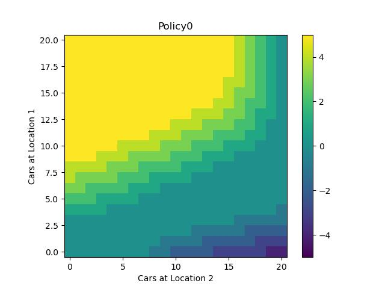
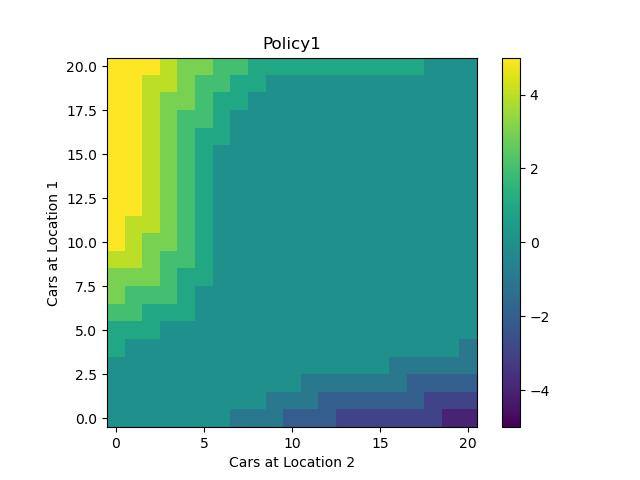
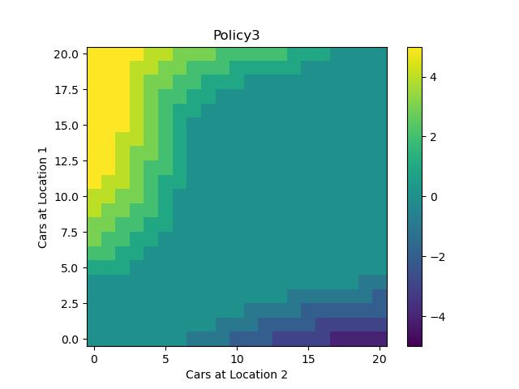
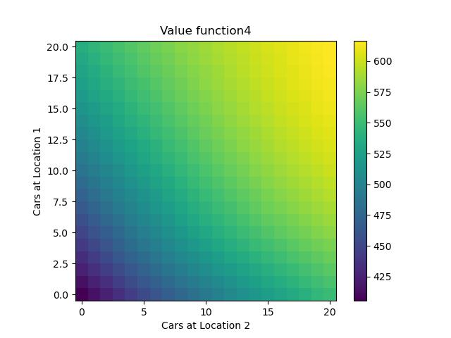
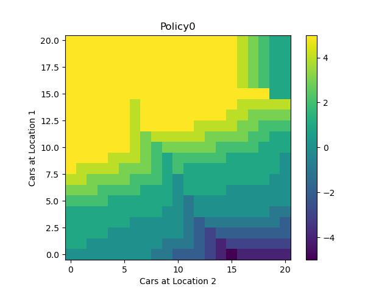
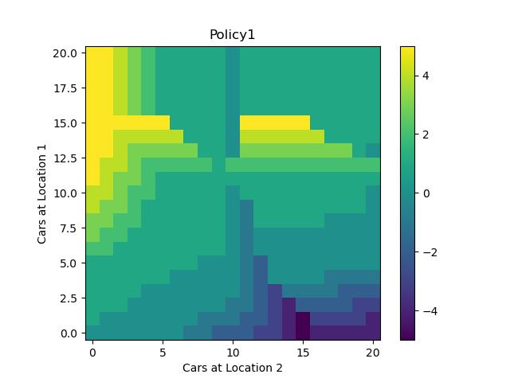
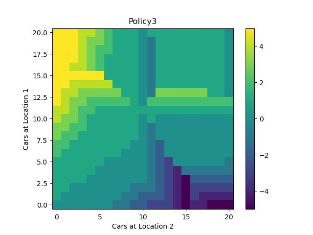
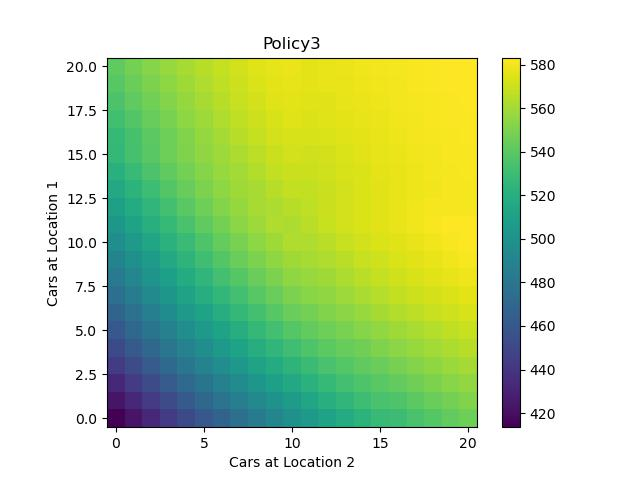

### Exercise 4.7

Write a program for policy iteration and re-solve Jack’s car rental problem with the following changes. One of Jack’s employees at the first location
rides a bus home each night and lives near the second location. She is happy to shuttle
one car to the second location for free. Each additional car still costs $2, as do all cars
moved in the other direction. In addition, Jack has limited parking space at each location.
If more than 10 cars are kept overnight at a location (after any moving of cars), then an
additional cost of $4 must be incurred to use a second parking lot (independent of how
many cars are kept there). These sorts of nonlinearities and arbitrary dynamics often
occur in real problems and cannot easily be handled by optimization methods other than
dynamic programming. To check your program, first replicate the results given for the
original problem.

results after running code

Figure 4.2 - Policies for Jack's car rental (Original Problem)

  
 

Values for optimal 

Policies for Jack's car rental (Variation Problem - Exercise 4.7)

 
 

 

Value for optimal policy

